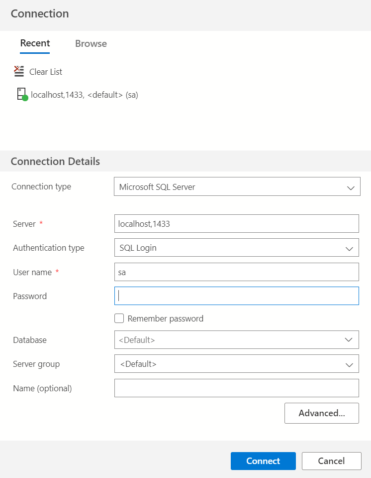

# Conectar a SQL Server usando nodejs y la librería mssql

1. Probando de forma local usando docker.
- descargar imagen docker desde el siguente [repositorio de imagenes](https://hub.docker.com/_/microsoft-mssql-server)

- En este punto voy a describir la seríe de comandos que puede ejecutar en su cosola windows/linux/mac luego que tenga instalado docker de forma local en su ordenador.

- Descargar imagen en el equipo
```docker pull mcr.microsoft.com/mssql/server```

- Iniciar un contenedor que se ejecute en segundo plano para levantar servidor sql server donde su puerto de exposición será el 1433 y usted deberá remplazar <INSERTE SU PASSWORD> por una pass que recuerde de al menos 8 digitos alfanúmerico .
```docker run -e "ACCEPT_EULA=Y" -e "SA_PASSWORD=<INSERTE SU PASSWORD>" -p 1433:1433 --name sqlserver -d mcr.microsoft.com/mssql/server:2017-CU8-ubuntu```

- Descargar Azure Data Studio para su sistema operativo en el siguien link [siguien link ](https://docs.microsoft.com/en-us/sql/azure-data-studio/download-azure-data-studio?view=sql-server-ver15)

- Probar la conn en Azure Data Studio usando el usuario: sa. Dejo imagen de refencia.
 

- Si hasta este punto todo va bien es hora de probar desde node.
    1. ingerse al archivo index.js
    2. en la linea 26 descomentar el siguien código.
    ```await sql.connect(sqlConfigLocal);```
    3. en la linea 7 colocar el PASSWORD con que creo el contenedor docker.
    4. ejecutar  ``` npm start ``` y debería obtener una salida con la versión del servidor sqlserver.

2. Probando en cloud.
    1. ingerse al archivo index.js
    2. en la linea 27 descomentar el siguien código.
    ```await sql.connect(sqlConfigCloud);```
    3. rellenar la constante ```const sqlConfigCloud ``` con las credenciales del servidor.
    4. ejecutar  ``` npm start ``` y debería obtener una salida con la versión del servidor sqlserver.


